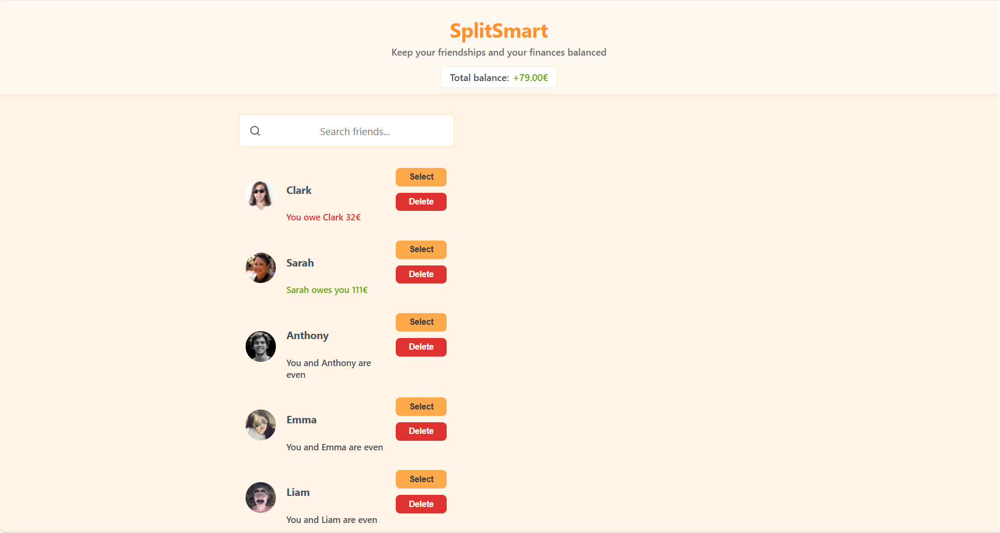
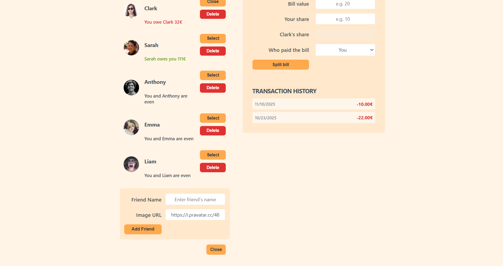
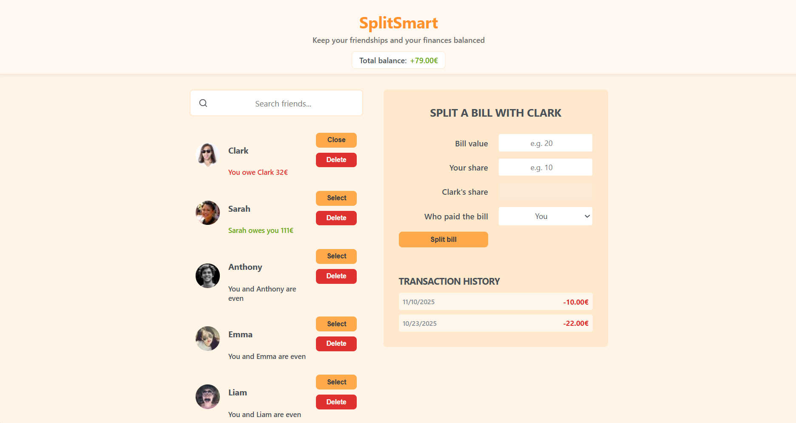
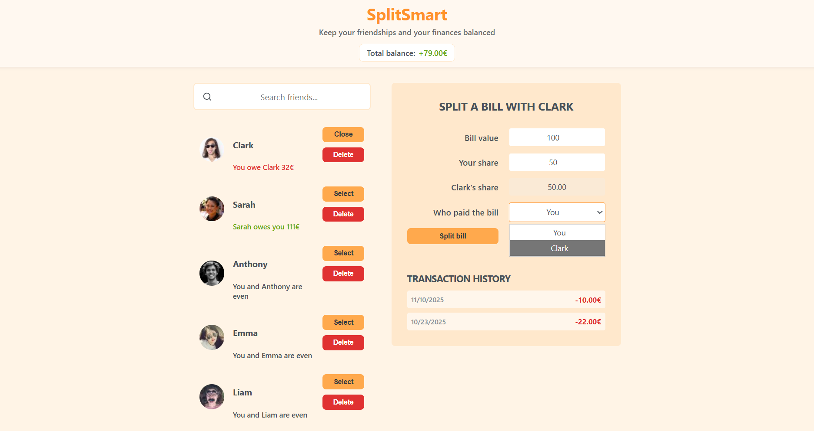

# SplitSmart 💸

SplitSmart is a simple and intuitive bill-splitting app that helps you track shared expenses with friends and keep balances clear and fair.  
It’s designed to make splitting bills stress-free while keeping friendships intact.

---

## 🚀 Live Demo

👉 https://YOUR-NETLIFY-URL.netlify.app  


---

## ✨ Features

-  Add and manage friends
-  Search friends by name
-  Split bills with selected friends
-  Automatically calculate who owes whom
-  Track transaction history per friend
-  See overall balance (positive or negative)
-  Smart validation for bill inputs
-  Fast and responsive UI

---

##  Screenshots

### Home Page


### Add Friend


### Split Bill – Example 1


### Split Bill – Example 2


---

## 🛠 Tech Stack

- **React**
- **Redux Toolkit**
- **React Hook Form**
- **CSS**
- **Lucide Icons**
- **Vite**

---

##  How It Works

1. Add friends to your list  
2. Select a friend  
3. Enter the bill amount and your share  
4. Choose who paid the bill  
5. The app calculates balances automatically  
6. Transactions are stored in global Redux state  

A positive balance means your friends owe you.  
A negative balance means you owe them.

---

## 🧑‍💻 Installation & Setup

Clone the repository:

```bash
git clone https://github.com/tamar-natchkebia/splitsmart.git
